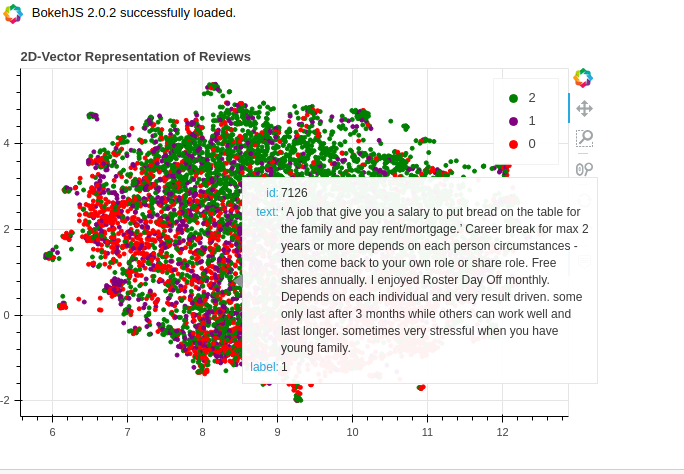
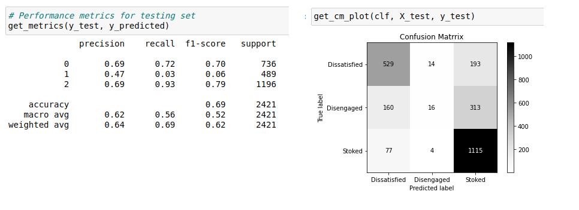
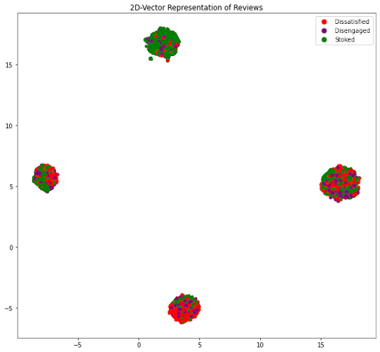
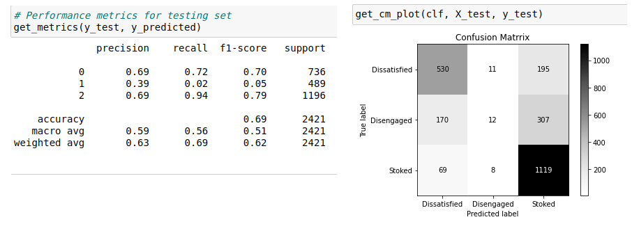
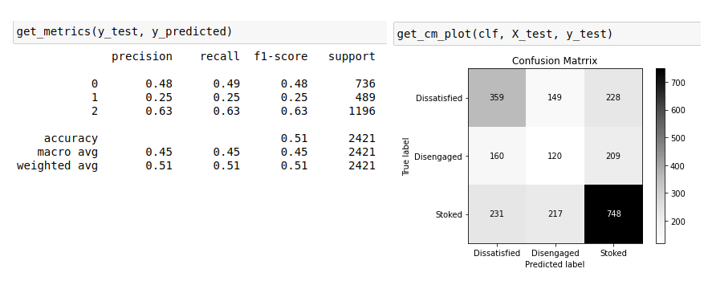
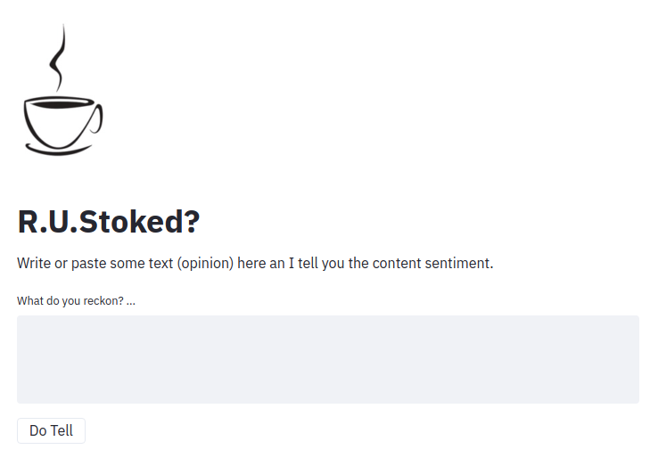

R.U.Stoked
===

**RUStoked** is an experimental **NLP** (_Sentiment Analysis_) project. An effort to orchestrate a pipe line of data from the early stage of data collection through Machine Learning model `deployment`.  

This post is more of a guide through the project stages, challenges, and lessons learned rather than a code review. The code is available on [GitHub](https://github.com/mohsen-saki/RUStoked) and I have tried to keep notebooks and code libraries explanatory as much as possible.  

**`IMPORTANT NOTE : This project is yet under development and some parts of `repo` may get updated accordingly`**  

This [GitHub](https://github.com/mohsen-saki/RUStoked) `repo` consists of:

* Folder [`data`](https://github.com/mohsen-saki/RUStoked/tree/master/data) which contains raw data and some lines of code for scraping data.
* Folder [`rustoked`](https://github.com/mohsen-saki/RUStoked/tree/master/rustoked) which contains a library of core functions used during data exploration and model development
* Folder [`notebooks`](https://github.com/mohsen-saki/RUStoked/tree/master/notebooks) which contains some notebooks to demonstrate data and model engineering process
* Folder [`app`](https://github.com/mohsen-saki/RUStoked/tree/master/app) which contains codes and functions for a small [streamlit](https://www.streamlit.io/) application running and maintaining the model.
* Folder [`withdrawn`](https://github.com/mohsen-saki/RUStoked/tree/master/withdrawn) which contains my first try to develop the model, not successful though.

Setup Environment
---

This repository has been tested on `python 3.8`

Clone the repo on a local machine

`$ git clone https://github.com/mohsen-saki/RUStoked.git`

Python Environment

`$ cd RUStoked`  
`$ python3 -m venv <virtualenv>`  
`$ source <virtualenv>/bin/activate`  

Install required packages

`$ pip install -r requirements.txt`  
`$ pip install -r requirements-app.txt`  
`$ python -m spacy download en_core_web_sm`  
`$ python -m spacy download en_core_web_lg`

To run the app locally:

`cd app`  
`streamlit run app.py`

**Deployment**

It has been automated through [GitHub Action](https://github.com/features/actions) to deploy [docker container](https://www.docker.com/resources/what-container) on both [Heroku](https://www.heroku.com/free) and [AWS ECS Instances](https://docs.aws.amazon.com/AmazonECS/latest/developerguide/ECS_instances.html). But, both processes cannot be triggered at the same time due to Heruko’s method for handling server side ports. See [Dockerfile](https://github.com/mohsen-saki/RUStoked/blob/master/Dockerfile) for differences and adjustment required.

To deploy on Heroku (or vice versa for aws)

`$ cd .github/workflows`  
`$ mv heroku.yml.deactivated heroku.yml`  
`$ mv aws.yml aws.yml.deactivated`

Heroku Prerequisite
* grab your Heroku account `api_token` and put it into _github repository secrets_ as `HEROKU_API_KEY = api_token` ([see here](https://help.heroku.com/PBGP6IDE/how-should-i-generate-an-api-key-that-allows-me-to-use-the-heroku-platform-api))
* creat an application instance on Heroku and put it's `"name"` into _github repository secrets_ as `HEROKU_APP_NAME = name` ([see here](https://devcenter.heroku.com/articles/creating-apps#creating-a-named-app))

AWS Prerequisite
* Need (recommended) an IAM account ([see here](https://docs.aws.amazon.com/IAM/latest/UserGuide/getting-started_create-admin-group.html))
* May need to create an ECS instance IAM role ([see here](https://docs.aws.amazon.com/AmazonECS/latest/developerguide/instance_IAM_role.html))
* Create an ECR repository ([see here](https://docs.aws.amazon.com/AmazonECR/latest/userguide/repository-create.html))
* May need to create security keay-pair (to SSH into container if needed) ([see here](https://docs.aws.amazon.com/AWSEC2/latest/UserGuide/ec2-key-pairs.html#prepare-key-pair))
* Need to create a "load ballancer", a "security group" (to open up port 80), and register a "target group" ([see here](https://docs.aws.amazon.com/AmazonECS/latest/developerguide/create-application-load-balancer.html))
* Need to create a "task-definition", "cluster", and "service" (using already created load-balancer, target-froup, secutity group, etc) ([see here](https://docs.aws.amazon.com/AmazonECS/latest/developerguide/getting-started-ecs-ec2.html))
* Probably need to revisit created security group to add a new inbound rule for port 8501 (from ECS dashboard)

### --> And it is live [here](https://rustoked.herokuapp.com/) on Heroku.

About the Project
====

1 What about is this project?
---
R.U.Stoked is a **Natural Language Processing** (Sentiment Analysis Case) but _not a binary_ one. I focused on detecting a third group of sentiment which I call here after `“Disengaged”`;  a group of opinions which are neither `“Stoked”` nor `“Dissatisfied”`.  I think detecting this group of users / customers can create business values in problem cases such as **Churning** or targeting **prospect customers**. Actually this idea is also sort of supported by the data; almost exactly half of reviews rated `3` out of `5` recommended their experience to others and the other half suggested not to. 

2 Where does data come from?
---
The [data](https://github.com/mohsen-saki/RUStoked/tree/master/data) has been collected from [SEEK](https://www.seek.com.au/). It comprises almost `13k` rows of data by which employees have expressed their feelings and opinions about their employers. I have just collected the data for a dozen of companies which have relatively had higher number of reviews.  And They mostly belong to two fields of FMCG retailers and Finance/Technology industries.

3 What are challenges?
---
* Detecting a _neutral_ class of sentiment in between `positive` and `negative` ones has been a bit of challenge because reading those reviews shows that the choice of words tends to be almost similar to either positive or negative reviews.
* Many of the reviews are written by _not-native English speakers_ and they vary a lot in terms of word choices, sentence structures, comprehension, etc.
* The SEEK template for registering reviews is asking for `pros` and `cons`. So, it has resulted in more of a list-like outcome rather than comprehensive opinions. For example in response to cons many may say “management” which clearly lacks the sentiment compared to something like “bad or poor management”.
* Another feature of SEEK’s reviews is that the overall rating is not calculated as average of employees’ ratings on some other subjects but it is acquired independently. This raised a bit of inconsistency between users' overall opinion of their client compared to their opinion on different aspects of their work paces.

4 First try and failure
---
There is a folder named “withdrawn” in the repository which contains a few notebooks as my first approach to this project which I consider as a _failure_ not particularly for the outcomes but more because of my strategy. I was sort of rushing to wrap it up which was not really working out and this is why:
* I did not collect enough data in terms of both the amount of data and the meta-data which help to explore and explain data beter.
* I did not tackle the problem according to the best practices. I created a pipeline of different models with various features and used the grid search method to see which one results in the best accuracy score. Obviously I did not put any time into data exploration and feature engineering. As a result, It was more of a black box with no insight of what is going on under the model performance.  
* I was not writing good codes. It was all in the notebooks (not reusable and  modular)  

However, I came across this excellent book [“Building Machine Learning Powered Applications“](https://www.oreilly.com/library/view/building-machine-learning/9781492045106/) written by [Emmanuel Ameisen](https://www.linkedin.com/in/ameisen/). Reading this book is actually the reason to reconsider my approach and start this project over.

5 What toolings/technologies have been used?
---
`pandas` to manipulate and explore the data  
`matplotlib` and `bokeh` to visualise and explore the data  

`TfifVectorizer` and in some cases `Spacy` to get the word vectors.  
`Scikit-Learn` RandomForestClassifier and Naive Bayes as model/algorithm  

6 How did it go?
---
First model trained on just the text data has performed pretty well on predicting positive and negative classes but poorly on the “Disengaged” class.

To tweak the model performance, I extracted some features from the data and plugged them in the vectors. Those features were selected to help the model detecting the sentiment better and distinguishing different labels easier such as:

* Words `great` and `good` appear frequently in positive opinions
* Words `poor`, `bad`, `not`, etc. appear frequently in negative opinions
* The _count_ of above words appears to be an indication of sentiment in each piece of review.
* The word `but` seems to have a higher frequency of occurring within “Disengaged” labels as it serves for changing the language tone from positive to negative or vice versa.  

Plugging above candidate features in the word vectors and visualization shows some improvement in separating data clusters each containing the majority of one of the labels but for the “Disengaged” label it still does not show much improvement:

And the outcome scores agree as well:

Well, I would say **if features are too obvious, probably the model has already picked them**. Using `Naive Bayes` algorithm as recommended by Scikit-Learn ([Choosing the right estimator](https://scikit-learn.org/stable/tutorial/machine_learning_map/index.html)) did not make a noticeable difference as expected.

However, using just features without the word vectors shows some improvement albeit at cost of model performance decrease on two other labels.

Working more on generating and extracting features seems like a promising approach to take here.

7 [The Application](https://rustoked.herokuapp.com/)
---
I have recently been hearing a lot about [Streamlit](https://www.streamlit.io/) and I wanted to try something new. Although it may not be as sophisticated as some backend frameworks such as [Flask](https://flask.palletsprojects.com/en/1.1.x/) and [Django](https://www.djangoproject.com/), I should say for a simple single-page webapp, [Streamlit](https://www.streamlit.io/) was super easy, extremely quick, and very cool.

8 Deployment
---
I went with a [docker](https://www.docker.com/) image as it is quite standard and straight forward. Deployment has been automated through [GitHub Action](https://github.com/features/actions) to trigger some workflows on push and deploy to [AWS ECS Instance](https://docs.aws.amazon.com/AmazonECS/latest/developerguide/ECS_instances.html) and [HEROKU](https://www.heroku.com/free), not at the same time though.

Obviously AWS required a lot more work around to get it orchestrating right and it is much stronger for providing this level of access to tweak the environment, however I love HEROKU for being simple and free :) as far as it is not consuming resources like a commercial webapp.

Anyway, it is live [here](https://rustoked.herokuapp.com/) on **heroku** and also [here]() on **aws** for a week or so :))

9 What’s next?
---
* Writing some tests and getting them to run through github actions.
* More on model development focusing on extracting and generating features

---
Thanks to open source and free world.
